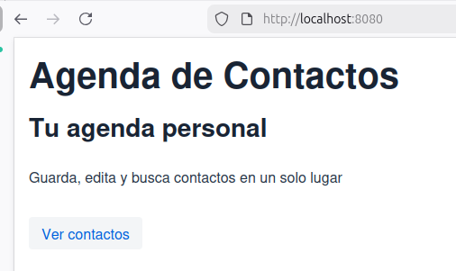
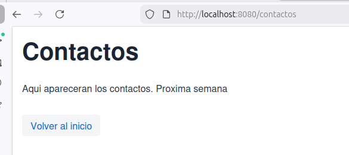

# Semana 07 - Agenda Web con Vaadin

## Descripción

Aplicación web desarrollada con Java, Spring Boot y Vaadin. Permite visualizar una página principal de Agenda de Contactos y navegar a una vista de contactos mediante botones utilizando componentes básicos de Vaadin.

## Cómo ejecutar la aplicacion

### 1. Ejecutar la aplicación

```bash
mvn spring-boot:run
```

### 2. Abrir en el navegador

```text
http://localhost:8080
```

## Captura de pantalla

### Vista Principal



### Vista de Contactos



### Vista de Contactos con Notificación


