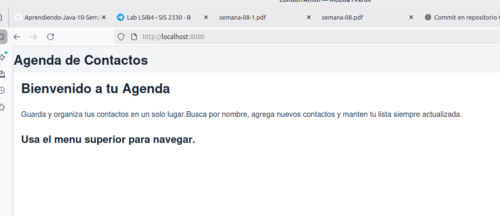
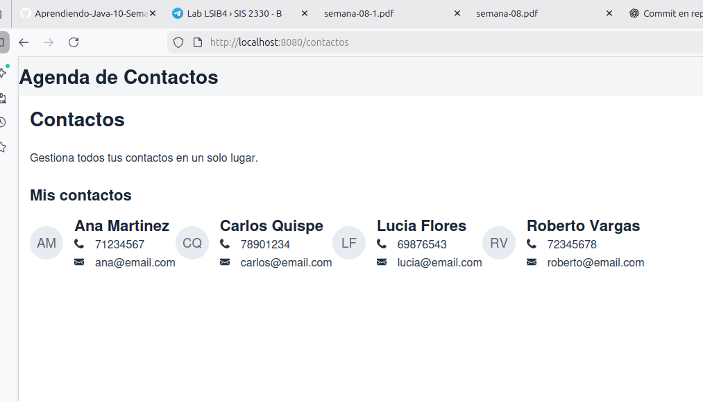
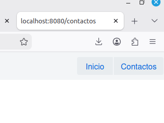
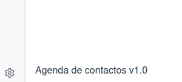

# Semana 08 - Agenda Web con Vaadin

## Descripción

Esta aplicación web permite gestionar una agenda de contactos mediante una interfaz desarrollada con Vaadin. Incluye una vista de inicio con información general de la aplicación y una vista de contactos donde se muestran tarjetas con datos de ejemplo. La navegación entre vistas se realiza mediante una barra superior sin recargar la página.

## Componentes utilizados

### 1. AppLayout
Contenedor principal de la aplicación que mantiene una barra de navegación visible en todas las vistas. 

### 2. MenuBar
Componente utilizado para mostrar las opciones de navegación entre las vistas Inicio y Contactos. 

### 3. RouterLink
Permite cambiar de vista mediante enlaces sin recargar la aplicación web. 

### 4. Avatar
Muestra las iniciales de cada contacto dentro de las tarjetas de información.

### 5. VaadinIcon
Se utiliza para representar visualmente el teléfono y correo electrónico de cada contacto. 

### 6. Div
Componente contenedor utilizado para construir la clase reutilizable `TarjetaContacto`. 

## Cómo ejecutar la aplicacion

### 1. Ejecutar la aplicación

```bash
mvn spring-boot:run
```

### 2. Abrir en el navegador

```text
http://localhost:8080
```

## Captura de pantalla

### Vista Principal



### Vista de Contactos



### Navegacion Inicio y Contactos



### Pie de pagina


